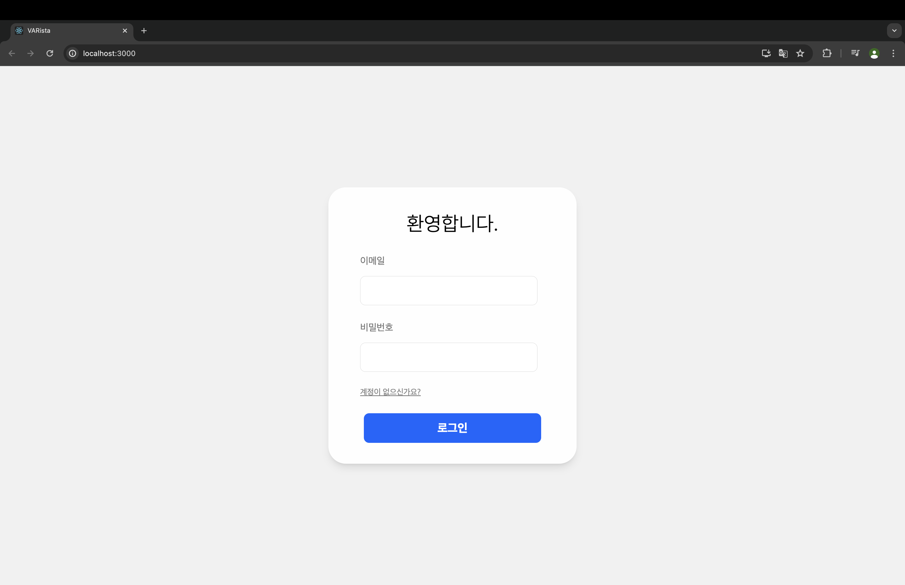
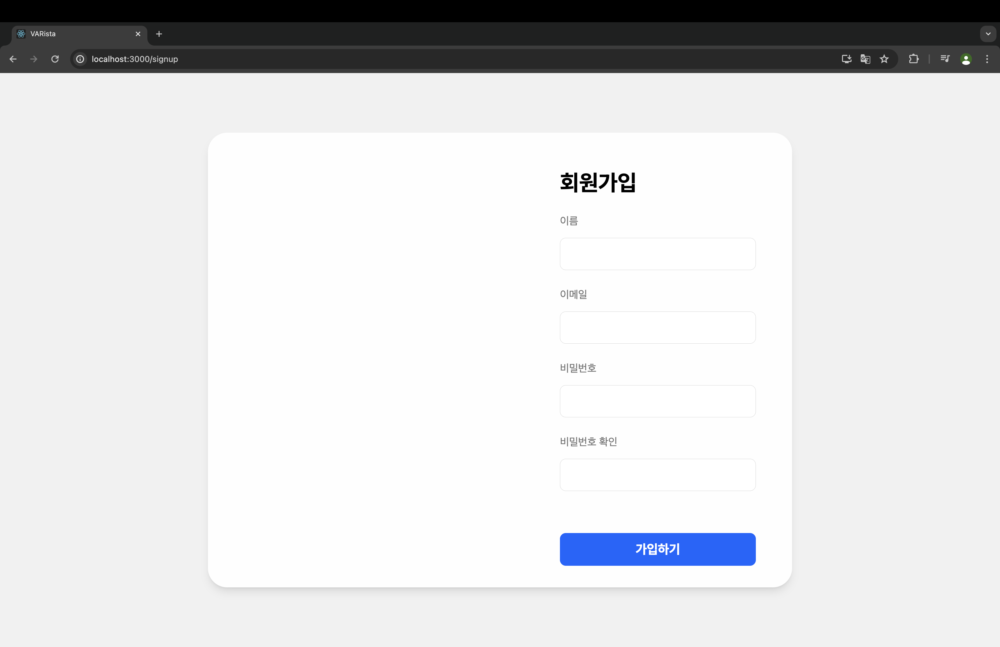
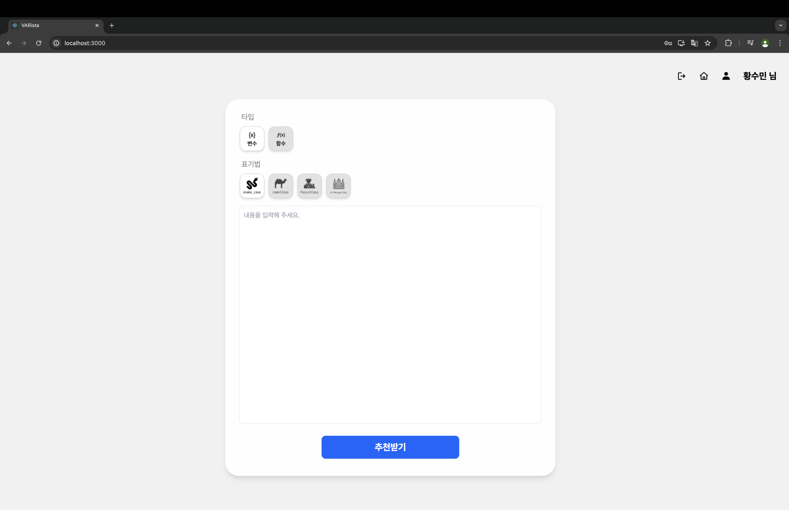
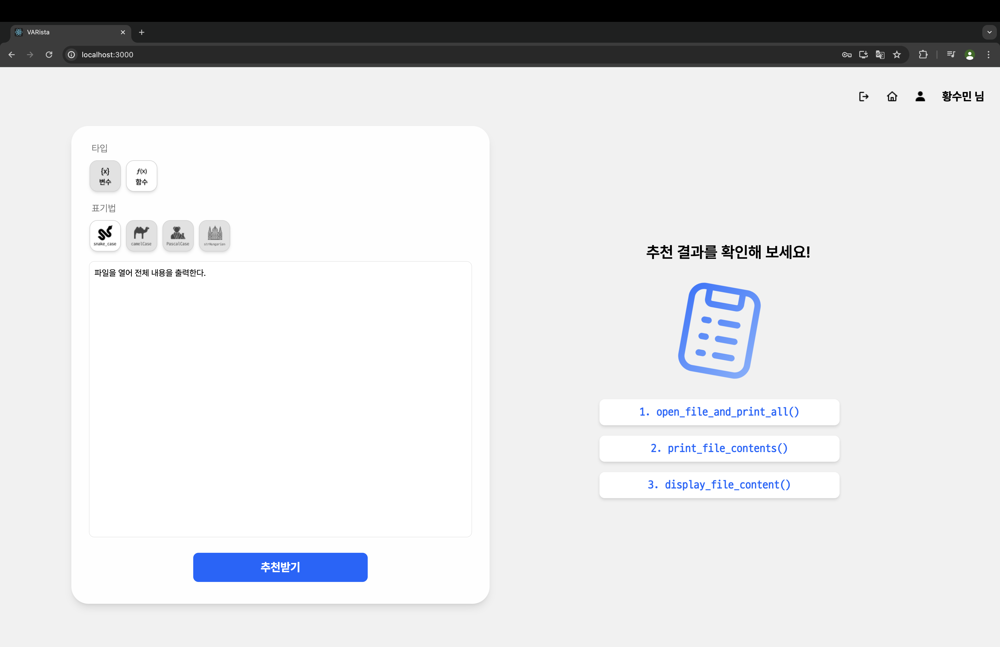
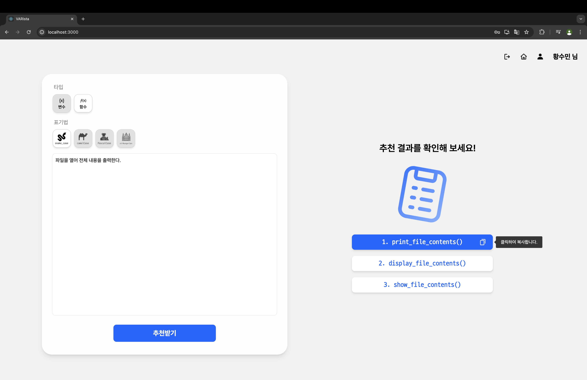
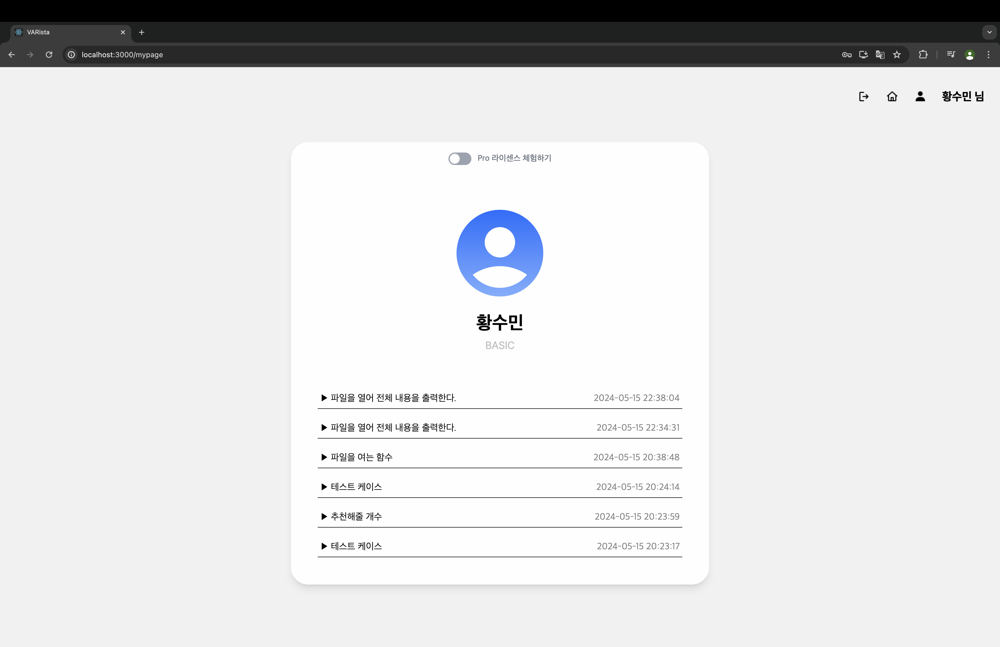
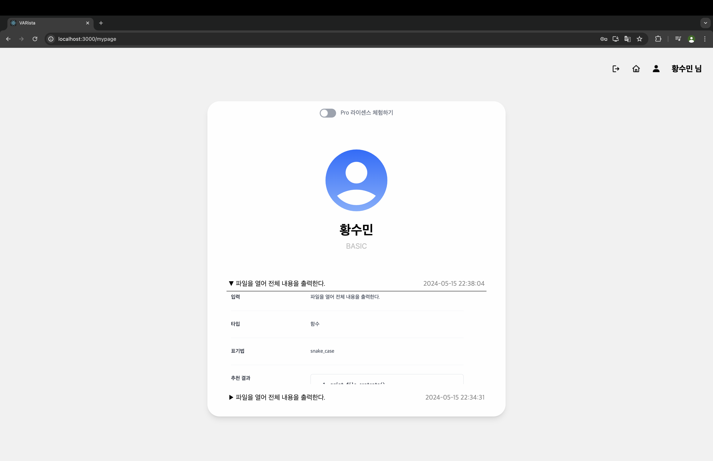
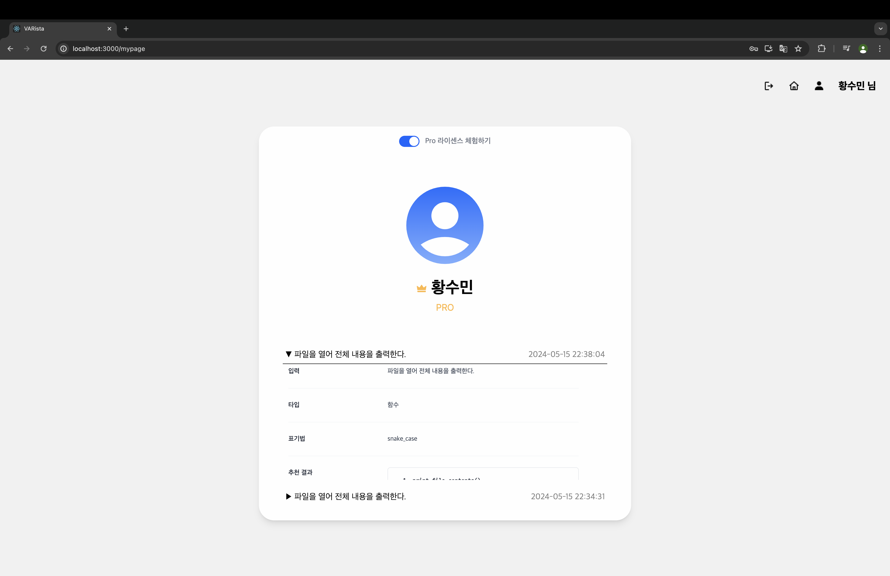
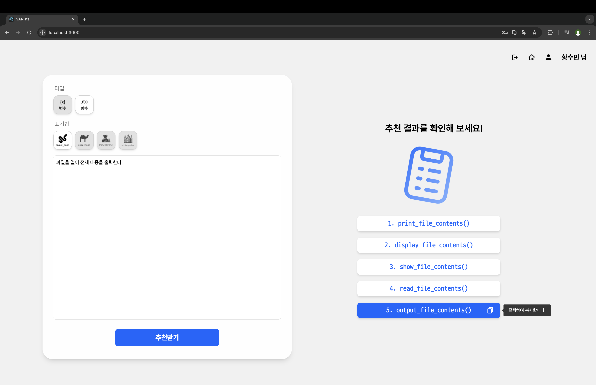

# Varista
## 1. 프로젝트 소개
### Varista란?
Varista는 변수를 뜻하는 var과 커피를 만드는 사람인 barista를 합성한 단어입니다.
바리스타는 커피에 대한 깊은 이해와 다양한 조합을 통해 최상의 결과물을 만듭니다.
마찬가지로, 'Varista'는 프로그래밍 언어와 관련된 변수 이름의 다양한 사용 사례와 패턴에 대한 풍부한 지식과 경험을 토대로 최적의 이름을 제안합니다.

### 프로젝트에 대하여...
Varista 프로젝트는 OpenAI API를 기반으로 한 변수/함수 이름 추천 웹 서비스입니다.
변수/함수 등 타입을 선택할 수 있을 뿐만 아니라 표기법까지 선택할 수 있어 개발자들이 추천받은 결과를 손쉽게 사용할 수 있습니다.

Figma 주소: https://www.figma.com/design/7jE5COzCvUFfaFiPgMJXbW/

## 2. 프로젝트 실행 방법
#### Varista 빌드와 실행에 필요한 애플리케이션
- Node.js v22.1.0
- Yarn v1.22.22

#### Client (React)

1. 먼저 Varista의 Github Repository를 원하는 경로에 clone합니다.
```console
$ git clone https://github.com/tnals0924/varista.git
```
2. clone한 Repository의 root 경로로 이동합니다.
```console
$ cd varista
```
3. 프로젝트의 root 경로에서 아래 명령어를 실행하여 Varista에 필요한 js 패키지 모듈을 설치합니다.
``` console
$ yarn install
```
4. 프로젝트의 root 경로에서 아래 명령어를 실행하여 React App을 실행합니다. (http://localhost:3000 으로 접속)
``` console
$ yarn start
```

#### Server (Node.js + Express)

varista-backend Repository: https://github.com/tnals0924/varista-backend

5. varista-backend Repository를 다른 경로에 clone합니다.
```console
$ git clone https://github.com/tnals0924/varista-backend.git
```

6. varista-backend Repository의 root 경로로 이동한 후, 아래 명령어를 실행하여 node.js 서버를 실행합니다. (http://localhost:4000 주소로 실행)
```console
$ yarn run start
```

## 3. 기술 스택

### Environment

<div>
    
    
    
    
    
</div>

### Config
<div>
    
</div>

### Development (Client)
<div>
    
    
    
    
    
    
</div>

### Development (Server)

<div>
    
    
    
    
</div>

### 이외에 사용한 React 라이브러리
- react-hot-toast (알림창 변경)
- react-tooltip (마우스 호버 시 보이는 툴팁 생성)
- react-copy-to-clipboard (버튼 클릭 시, 특정 텍스트를 클립보드에 복사하는 기능 추가)

## 4. 주요 기능 설명

### 4.1 회원가입 / 로그인



웹에 처음 접속하면 로그인 화면이 보인다. 계정이 따로 없다면 '계정이 없으신가요?'를 클릭하여 회원가입 페이지로 이동할 수 있습니다.



회원가입 페이지에서 이름, 이메일, 비밀번호, 비밀번호 확인 칸을 입력하여 회원가입을 진행합니다.

로그인과 회원가입은 Firebase Authentication을 이용하여 구현하였습니다. 이메일과 전화번호, 사용자의 이름까지 Firebase Authentication 서비스를 이용하고, Recoil 라이브러리를 이용하여 상태를 관리합니다.

### 4.2 맞춤 변수이름 추천



로그인에 성공하면 메인 페이지로 이동하는데, 이 곳에서 추천받을 타입(변수/함수), 표기법을 선택할 수 있습니다.

표기법은 주로 사용되는 snake_case, camelCase, PascalCase, HungarianCase 중에서만 선택이 가능합니다.

타입과 표기법의 선택이 끝나면 추천받고 싶은 함수나 변수의 내용을 한글로 작성합니다.

모든 선택이 끝나면 '추천받기' 버튼을 눌러 이름을 추천받을 수 있습니다.

'추천받기' 버튼을 클릭하면, axios 라이브러리를 이용해 node.js 서버에 추천 메시지를 보내고, 서버에서 OpenAI API를 이용하여 추천 결과를 받아옵니다. 서버는 받아온 추천 결과를 다시 React App에게 보내주고, React App에서는 받아온 데이터를 가공하여 표시합니다.

아래는 '파일을 열어 전체 내용을 출력한다'라는 내용의 함수 이름을 snake_case로 추천받은 사진입니다.



이렇게 추천받은 결과는 마우스로 클릭하여 클립보드에 복사할 수 있습니다.



### 4.3 추천 기록 확인

웹페이지의 우측 상단에 있는 유저 아이콘을 통해 마이페이지로 이동할 수 있습니다.

마이페이지는 아래와 같이 구성되어 있습니다.



마이페이지에서는 자신의 라이선스를 확인할 수 있고, 지금까지 추천을 받았던 기록을 전부 확인할 수 있습니다.
기록을 클릭하면 해당 기록의 세부 정보를 확인할 수 있습니다. 아래는 '파일을 열어 전체 내용을 출력한다'라는 내용의 함수를 추천받았던 기록의 세부 정보를 확인하는 모습입니다.



기록의 세부 정보와 기록 목록은 모두 스크롤을 내려 목록 확인이 가능합니다.

기록들은 서버로부터 추천 결과 응답을 받을 때 Firebase Realtime Database에 저장됩니다.

### 4.4 Pro 라이선스

마이페이지에서 유저 이미지 위에 있는 'Pro 라이선스 체험하기' 토글 버튼을 클릭하면 Pro 라이선스를 활성화할 수 있습니다.

Pro 라이선스 정보는 Recoil 라이브러리를 이용하여 상태를 관리합니다.

Pro 라이선스를 활성화하면 아래와 같이 마이페이지에서 유저의 라이선스 표시가 변경됩니다.



기존의 Basic 라이선스는 이름을 3개만 추천받을 수 있었지만, Pro 라이선스는 5개를 추천받을 수 있습니다.

